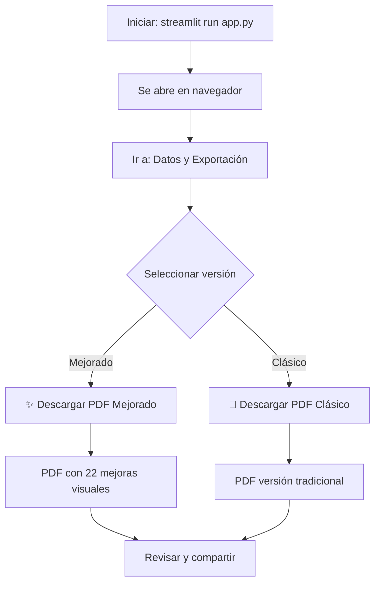

# ⚡ Inicio Rápido - PDF Mejorado en Streamlit

## 🎯 ¡La integración ya está LISTA!

El PDF mejorado ya está integrado en tu aplicación Streamlit y listo para usar.

---

## 📋 Checklist de Verificación

Antes de ejecutar, verifica:

```bash
# 1. Verifica que tienes fpdf2 instalado
pip list | grep fpdf2

# Si no aparece, instala:
pip install fpdf2

# 2. Verifica que los archivos existen
ls utils/pdf_generator_mejorado.py
ls views/dashboard.py

# 3. Ejecuta el test (opcional pero recomendado)
python test_integracion_streamlit.py
```

---

## 🚀 Ejecutar la Aplicación (3 Pasos)

### **Paso 1: Iniciar Streamlit**
```bash
streamlit run app.py
```

Tu navegador se abrirá automáticamente en `http://localhost:8501`

### **Paso 2: Navegar al Dashboard**
1. Si no estás en "📊 Dashboard General", selecciónalo en el sidebar
2. Haz clic en la pestaña **"📥 Datos y Exportación"**

### **Paso 3: Descargar el PDF**
1. Verás dos opciones:
   ```
   Selecciona la versión del PDF:

   (●) ✨ PDF Mejorado (Recomendado)
   ( ) 📄 PDF Clásico
   ```

2. Selecciona **"✨ PDF Mejorado"**

3. Haz clic en **"✨ Descargar PDF Mejorado"**

4. ¡Listo! El PDF se descargará automáticamente

---

## 🎨 Comparación Visual Rápida

### PDF Clásico
```
┌─────────────────────────┐
│ • Portada              │
│ • Resumen ejecutivo    │
│ • Líneas estratégicas  │
│ • Tabla de indicadores │
│ • Análisis IA          │
└─────────────────────────┘
```

### PDF Mejorado ⭐
```
┌──────────────────────────────┐
│ • Portada                   │
│ • ✨ Tarjetas visuales KPIs │
│ • ✨ Barra progreso global  │
│ • ✨ Heatmap de líneas      │
│ • ✨ Páginas por línea      │
│ • ✨ Análisis IA destacado  │
│ • ✨ Tabla mejorada         │
│ • ✨ Glosario de siglas     │
│ • ✨ Top 3 logros           │
│ • ✨ Conclusiones           │
└──────────────────────────────┘
```

---

## 📊 Ejemplo de Flujo Completo



---

## 💡 Tips Rápidos

### ✅ **Recomendado para:**
- Presentaciones ejecutivas
- Reportes mensuales/trimestrales
- Stakeholders externos
- Junta directiva

### 📄 **PDF Clásico para:**
- Uso interno rápido
- Compatibilidad con sistemas antiguos
- Impresión en blanco y negro

---

## 🔍 Vista Previa de la Interfaz

Cuando ejecutes la app, verás algo así:

```
┌────────────────────────────────────────────────────────┐
│ 📊 Informe Estratégico POLI 2025                      │
│ Plan de Desarrollo Institucional | Seguimiento        │
├────────────────────────────────────────────────────────┤
│                                                        │
│ [📊 Resumen] [📈 Análisis] [📥 Datos y Exportación]  │
│                                                        │
│ ┌────────────────────────────────────────────────┐   │
│ │ 📄 Informe PDF Corporativo                     │   │
│ │                                                 │   │
│ │ Selecciona la versión del PDF:                │   │
│ │                                                 │   │
│ │ ⚪ ✨ PDF Mejorado (Recomendado)              │   │
│ │ ⚪ 📄 PDF Clásico                              │   │
│ │                                                 │   │
│ │ [✨ Descargar PDF Mejorado] ◄─── Haz clic aquí│   │
│ │                                                 │   │
│ │ ✅ PDF generado exitosamente (245.3 KB)       │   │
│ └────────────────────────────────────────────────┘   │
│                                                        │
└────────────────────────────────────────────────────────┘
```

---

## ⚠️ Problemas Comunes y Soluciones

### 1. "No module named 'pdf_generator_mejorado'"
```bash
# Verifica que el archivo existe
ls utils/pdf_generator_mejorado.py

# Si no existe, crea un issue
```

### 2. El botón no aparece
```bash
# Reinicia Streamlit
Ctrl + C
streamlit run app.py
```

### 3. Error al generar PDF
```bash
# Ejecuta el diagnóstico
python validar_sistema_pdf.py
```

---

## 🎯 Siguiente Paso

**Ahora mismo, ejecuta:**

```bash
streamlit run app.py
```

**Y luego:**
1. Ve a "Datos y Exportación"
2. Selecciona "PDF Mejorado"
3. Descarga el PDF
4. ¡Compara con el PDF clásico!

---

## 📚 Más Información

- **Guía completa:** [GUIA_INTEGRACION_STREAMLIT.md](GUIA_INTEGRACION_STREAMLIT.md)
- **Documentación técnica:** [README_PDF_MEJORADO.md](README_PDF_MEJORADO.md)
- **Personalización:** Ver sección de colores en `pdf_generator_mejorado.py`

---

## ✨ ¡Disfruta de tus nuevos informes PDF!

**Generado con ❤️ para el Politécnico Grancolombiano**
